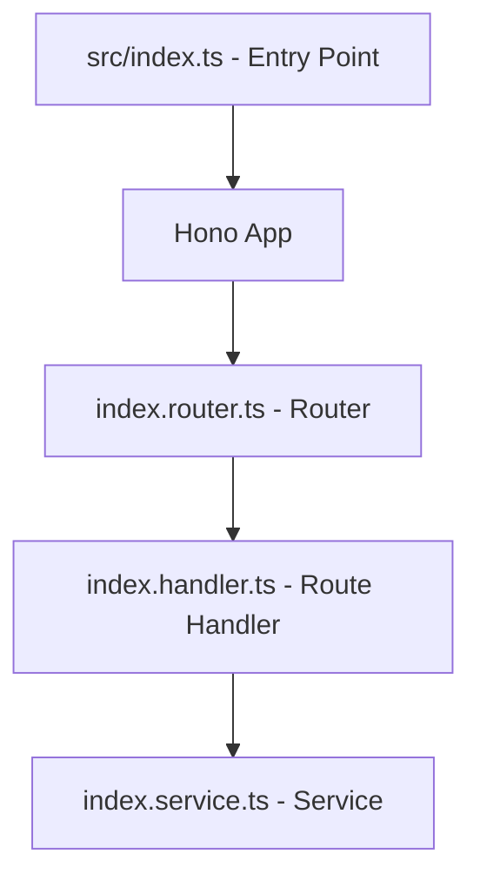

# Design Document: Project Initialization

## Overview

This document describes the technical design for initializing the project with a TypeScript/Node.js stack using Hono as the HTTP framework, the Vercel AI SDK, and Vitest for testing. The deliverable is a runnable "Hello World" HTTP server with a clean directory structure and a passing test suite.

The design follows a layered architecture: a thin route handler delegates to a service, which contains the business logic. This separation is established from the start so the pattern is consistent as the project grows.

## Architecture



The entry point creates the Hono app, registers routers, and starts the HTTP server. Each feature area gets its own router module under `src/routes/`. Route handlers are thin — they parse the request, call a service method, and return the response. Services hold all business logic.

## Components and Interfaces

### Entry Point (`src/index.ts`)

Bootstraps the application:
- Creates the Hono app instance
- Registers the index router on `/`
- Reads `PORT` from environment, defaults to `3000`
- Starts the server and logs the listening address

### Index Router (`src/routes/index.router.ts`)

A Hono `Hono` instance that registers the `GET /` route and delegates to the index handler.

### Index Handler (`src/routes/index.handler.ts`)

A thin Hono handler function. Calls `IndexService.getHello()` and returns the result as JSON with status 200.

### Index Service (`src/services/index.service.ts`)

Contains the business logic for the index endpoint. Exposes a single method:

```typescript
class IndexService {
  getHello(): { message: string }
}
```

### Directory Structure

```
src/
  index.ts                        # Entry point
  routes/
    index.router.ts               # Root router
    index.handler.ts              # GET / handler
  services/
    index.service.ts              # Hello World business logic
  repositories/                   # (empty, reserved for data access)
  types/                          # (empty, reserved for shared types)
```

### Build Toolchain (`package.json` scripts)

| Script        | Command                  | Purpose                        |
|---------------|--------------------------|--------------------------------|
| `dev`         | `tsx watch src/index.ts` | Development server with reload |
| `build`       | `tsc`                    | Compile TypeScript to JS       |
| `start`       | `node dist/index.js`     | Run compiled output            |
| `test`        | `vitest --run`           | Run tests once and exit        |

### TypeScript Configuration (`tsconfig.json`)

- `strict: true` — enables all strict type checks
- `module: NodeNext` — modern Node.js ESM/CJS interop
- `moduleResolution: NodeNext` — matches module resolution to Node.js
- `outDir: dist` — compiled output directory
- `rootDir: src` — source root

## Data Models

### HelloResponse

The JSON shape returned by `GET /`:

```typescript
interface HelloResponse {
  message: string; // Always "Hello, World!" for this endpoint
}
```

### Environment Configuration

```typescript
interface AppConfig {
  port: number; // Resolved from process.env.PORT ?? 3000
}
```

No database or persistent storage is involved in this initialization feature.


## Correctness Properties

### Property 1: GET / returns correct status and body

*For any* valid HTTP GET request to `/`, the response SHALL have status `200` and a JSON body equal to `{ "message": "Hello, World!" }`.

**Validates: Requirements 3.1, 3.2, 3.4**

### Property 2: PORT environment variable controls listen port

*For any* valid port number supplied via the `PORT` environment variable, the application SHALL bind its HTTP server to that port.

**Validates: Requirements 4.1**

### Property 3: Default port when PORT is unset (edge case)

*When* the `PORT` environment variable is absent, the application SHALL bind to port `3000`.

**Validates: Requirements 4.2**

### Property 4: Project structure invariants

*For any* fresh checkout, the required source directories (`src/routes/`, `src/services/`, `src/repositories/`, `src/types/`) SHALL exist, `src/index.ts` SHALL exist, and the Java placeholder directories (`src/main/java/`, `src/test/java/`) SHALL NOT exist.

**Validates: Requirements 2.1, 2.2, 2.3**

### Property 5: Package manifest correctness

*For any* fresh checkout, `package.json` SHALL declare the required production and development dependencies, and all four npm scripts (`dev`, `build`, `start`, `test`) SHALL be present with the correct commands.

**Validates: Requirements 1.1, 1.2, 1.3, 1.4, 1.5, 1.6**

### Property 6: Test suite exit codes

*When* all tests pass, `npm test` SHALL exit with code `0`. *When* any test fails, `npm test` SHALL exit with a non-zero code.

**Validates: Requirements 5.3, 5.4**

## Error Handling

| Scenario | Behaviour |
|---|---|
| `PORT` env var is not a valid number | Hono's underlying `serve()` will throw; the process exits with a non-zero code. No special handling needed at this stage. |
| Unhandled route (e.g. `GET /unknown`) | Hono returns its default `404 Not Found` response automatically. |
| Uncaught exception during startup | Node.js prints the stack trace and exits non-zero. No custom error boundary is required for this initialization phase. |

## Testing Strategy

### Unit Tests (Vitest)

Use Hono's built-in `app.request()` test helper — no real HTTP server needed.

- `GET /` returns status `200` and body `{ "message": "Hello, World!" }` (covers Properties 1, and validates Requirements 3.1, 3.2)
- `IndexService.getHello()` returns `{ message: "Hello, World!" }` directly (validates Requirements 5.1, 5.2)
- Server startup logs the listening address to stdout (validates Requirement 4.3)

### Property-Based Tests (fast-check + Vitest)

Each property test MUST run a minimum of **100 iterations**.

Each test MUST include a comment tag in the format:
`// Feature: project-initialization, Property <N>: <property_text>`

| Property | Test description | fast-check arbitraries |
|---|---|---|
| Property 2 | For any port in `[1024, 65535]`, the app binds to that port | `fc.integer({ min: 1024, max: 65535 })` |

### Test File Layout

```
src/
  routes/
    index.handler.test.ts   # Unit tests for GET / via app.request()
  services/
    index.service.test.ts   # Unit tests for IndexService
```
