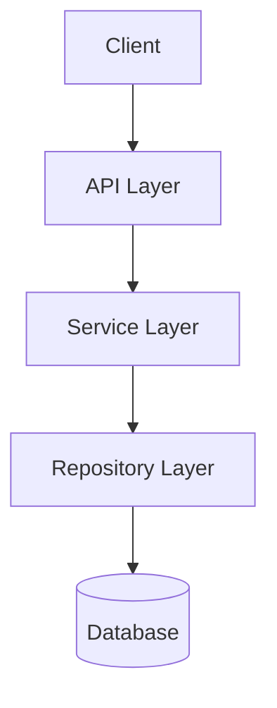
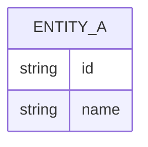

# Technical Architecture Design

## System Architecture

## Components
| Component | Responsibility | Technology |
|-----------|---------------|------------|
| API Layer | Handle HTTP requests | Hono Route Handler |
| Service Layer | Business logic | TypeScript Service |
| Repository Layer | Data access | Repository interface |
| AI Layer | AI model calls | Vercel AI SDK |

## Data Model

## API Design
| Method | Path | Description |
|--------|------|-------------|
| GET | /api/v1/... | ... |
| POST | /api/v1/... | ... |

## Technical Decisions
> Record important architecture decisions in `archives/adr/`
